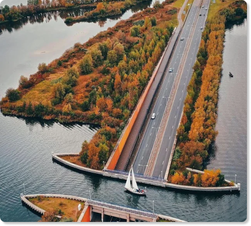
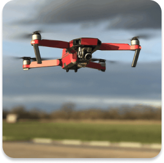
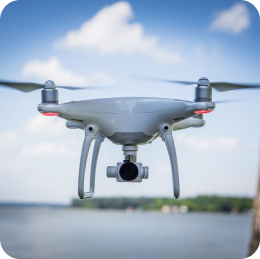
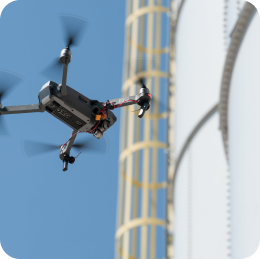
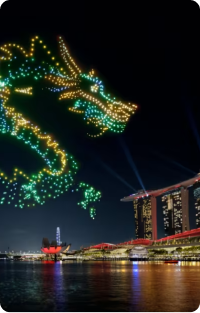
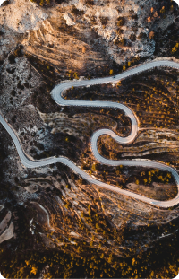
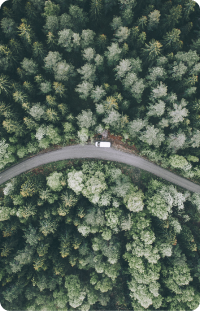
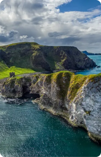
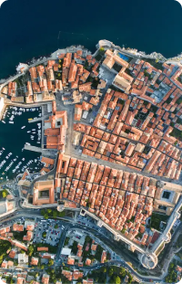
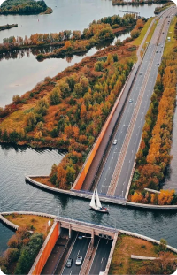

index.html:
<!DOCTYPE html>
<head>
    <meta charset="utf-8">
    <title>Aerialvision.</title>
    <meta content="width=device-width, initial-scale=1.0" name="viewport">
    <meta content="wiebren,wiebren-3,html,webdevelopment,fivem,fivemdevelopment,mlo" name="keywords">
    <meta content="In het gezellige Heerenveen is sinds januari 2024 iets tofs aan de gang - AerialVision is op de kaart gekomen. En de man achter dit avontuur is niemand minder dan Wiebren. Het begon allemaal toen Wiebren zelf stoeide met de uitdaging van hoge daken en goten inspecteren. Snap je wel, dat is niet makkelijk. Maar goed, vanuit die struggle bedacht hij iets slim: drones!
    Dus, wat doet AerialVision? Nou, eigenlijk van alles wat met drones te maken heeft. Ze maken supergedetailleerde 3D-modellen, schieten vette video's, knallen toffe foto's en doen inspecties. En dit allemaal vanuit de lucht. Dus niet alleen kan je je dak laten checken zonder een ladder te gebruiken, maar AerialVision maakt ook landkaarten voor van alles en nog wat.
    Wat begon als een handige oplossing voor Wiebren, groeide uit tot een heel bedrijf dat de lucht als speelveld heeft. AerialVision tilt niet alleen Wiebren's kijk op dingen naar een hoger niveau, maar opent ook de deur voor iedereen die een beetje avontuurlijk de wereld wil zien. Het is als een nieuw perspectief van boven - hoe vet is dat?" name="description">
    <meta content="Homepagina || Aerialvision" name="title">
    <link rel="preconnect" href="https://fonts.googleapis.com">
    <link rel="preconnect" href="https://fonts.gstatic.com" crossorigin="">
    <link href="https://fonts.googleapis.com/css2?family=Inter:wght@300;400&amp;family=McLaren&amp;family=Ubuntu:wght@300&amp;display=swap" rel="stylesheet">
    <link href="https://fonts.googleapis.com/css2?family=Inter:wght@300&amp;display=swap" rel="stylesheet">
    <link href="https://fonts.googleapis.com/css2?family=Inter:wght@300&amp;family=Karantina:wght@300&amp;display=swap" rel="stylesheet">
    <link href="https://fonts.googleapis.com/css2?family=Inter:wght@300;400&amp;family=Luckiest+Guy&amp;family=McLaren&amp;family=Ubuntu:wght@300&amp;display=swap" rel="stylesheet">
    <link href="https://fonts.googleapis.com/css2?family=Poppins:ital,wght@0,100;0,200;0,300;0,400;0,500;0,600;0,700;0,800;0,900;1,100;1,200;1,300;1,400;1,500;1,600;1,700;1,800;1,900&amp;display=swap" rel="stylesheet">
    <link href="https://aerialvision.space/assets/icons/logo_round.png" rel="icon">
    <link rel="stylesheet" href="style.css">
    <link href="https://client.relay.crisp.chat" rel="dns-prefetch" crossorigin=""><link href="https://client.crisp.chat" rel="preconnect" crossorigin=""><link href="https://client.crisp.chat/static/stylesheets/client_default.css?05969e3" type="text/css" rel="stylesheet">
</head>
<body>
    

        <nav>
            
Aerialvision<b>.</b>

            <a href="/">HOME</a>
            <a href="https://aerialvision.space/over-ons">OVER ONS</a>
            <a href="https://aerialvision.space/diensten">DIENSTEN</a>
            <a href="https://aerialvision.space/gallerij">GALLERIJ</a>
            <a href="https://aerialvision.space/contacteer-ons">CONTACT</a>

            
            
            
        </nav>

        <h1 class="h1">GESPECIALISEERD IN</h1>
        <h2 class="h2">DRONE OPERATIONS</h2>
        <h3 class="h3">VIDEOS / FOTO’S / INSPECTIES</h3>

        

            <a href="https:/aerialvision.space/diensten">ONTDEK NU</a>
        

    

    

        

        <h1><a>KWALITEIT</a> DIENSTEN</h1>
        
Bij AerialVision draait alles om topkwaliteit diensten die de verwachtingen overtreffen. Onze drone mapping-service levert niet alleen nauwkeurige 3D-modellen en gedetailleerde 2D-kaarten, maar biedt ook een ongeëvenaarde precisie die cruciaal is voor diverse toepassingen. Of het nu gaat om het verkennen van bouwterreinen, landmetingen of stadsplanning, wij leveren resultaten waarop u kunt vertrouwen. 
             
            Onze drone videografie tilt storytelling naar nieuwe hoogten. Van adembenemende luchtperspectieven tot dynamische bewegingen, wij vangen momenten met cinematografische pracht. AerialVision's dronefotografie legt niet alleen beelden vast, maar creëert herinneringen die blijven hangen. Van huwelijksfeesten tot zakelijke evenementen, wij zorgen voor verbluffende foto's die de essentie van het moment vastleggen. 
             
            Voor inspectiediensten zijn wij de onbetwiste keuze. Met drones kunnen we moeiteloos ontoegankelijke plaatsen bereiken, zoals daken en schoorstenen, voor nauwkeurige beoordelingen zonder gedoe. AerialVision staat garant voor betrouwbaarheid en grondige inspecties, waardoor u gemoedsrust heeft. 
             
            Bij AerialVision zijn kwaliteit en professionaliteit de kern van wat we bieden. Onze ervaren teamleden combineren technische bekwaamheid met creativiteit om diensten te leveren die niet alleen voldoen aan, maar overtreffen wat u verwacht. Ontdek de wereld vanuit een nieuw perspectief met AerialVision - waar elke dienst een meesterwerk is.
        

    

    

        <h1>LATEST NEWS</h1>

        

            

            

                <h1 class="article-date">29 DECEMBER 2023</h1>
                
Verlaging van onze tarieven na veel interesse?

            

        

        

            

            

                <h1 class="article-date">6 JANUARI 2024</h1>
                
Uitbreiding van onze diensten naar omliggende dorpen?

            

        

        

            

            

                <h1 class="article-date">20 JANUARI 2024</h1>
                
Nieuwe dienst toevoeging aan ons pakket, inspecties?

            

        

        

            

            

                <h1 class="article-date">29 JANUARI 2024</h1>
                
Nieuwe dienst toevoeging aan ons pakket, inspecties?

            

        

    

    

        <h1 class="title"><a>OUR</a> PREVIEWS</h1>

        
        
        
        
        
        
    

    

        

            
            
            
        

        
<a href="information">Info</a> ◦ <a href="support">Support</a> ◦ <a href="marketing">Marketing</a>

        
<a href="tos">Terms of Service</a> ◦ <a href="tos/privacypolicy">Privacy Policy</a>

        
<a href="copyright">© 2023 Aerial Vision</a>

    

</body>

style.css:
body {
    margin: 0;
    padding: 0;
    font-family: "Poppins", sans-serif;
    background-color: #262626;
}

.first-part {
    width: 100%;
    height: 100vh;
    background-image: url('assets/images/drone_desert.jpg');
    background-size: cover;
}

.first-part nav {
    width: 80%;
    height: 3%;
    padding: 5px;
    background-color: aliceblue;
    border-radius: 50px;
}

First-part:
als eerste, de achtergrond, deze neemt 100% van de hoogte en breedte. Daarnaast zit er op 1% hoogte van de bovenkant van de achtergrond, een navbar, deze is in de kleur #F0F8FF. Dan heb je de p van de nav, deze is in de kleur #0062FF, en de b is in de kleur #000000 dit is beide in de font poppins, in de font-weight 700 .  Dan heb je in dezelfde navbar, op een horizontale rij in het midden van de navbar zit de text dus, in de font poppins, en font size 20 en fontweight 200, en met een kleine ruimte ertussen. Dan heb je daarnaast dan vervolgens de 3 logos, en deze zitten ook op een horizontale rij in het midden kwa hoogte van de nav, en zonder streepje eronder.

Vervolgens heb je op 50% hoogte van de bovekant van de achtergrond de text in font poppins met fontweight 50 fontsize 20 en in het midden gecentreerd, zit een text in de kleur #FFFFFF, dit is h1.

Vervolgens heb je h2 1% onder h1 met font-size 60px en ook in kleur #FFFFFF, en in het midden gecentreerd. Deze is in fontweight 250. ook in font poppins

Vervolgens heb je h3, in font poppins. in fontsize 20px, in het midden gecentreerd font weight 50, en kleur #FFFFFF. 

Vervolgens daaronder, ook in het midden zit de discover-now border, in kleur #FFFFFF, deze is 12.5% breedt, en 5% hoog. en heeft een border-radius van 10px. Daarin zit in het midden a, zonder text-decoration, en in de kleur #FFFFFF, fontsize 20px.

Second-part:
Dit zit direct onder first-part, met achtergrond kleur #262626

Vervolgens heb je img, aan de linker kant 2.5% van de zijkant met een border-radius van 10px, hij zit 3.5% van de bovenkant van second-part. Daarnaast rechts, zit h1 , deze zit rechts naast img ook op 3.5% hoogte van de bovenkant en 2% afstand van img aan de linkerkant, deze is in font-size 35px en fontweight 200, deze is in kleur #FFFFFF, h1 a is  in kleur #0062FF. 

Dan heb je ook naast img, heb je p op 2.5% afstand van img onder h1, in de font poppins, fontsize 12.5px en fontweight 50.
